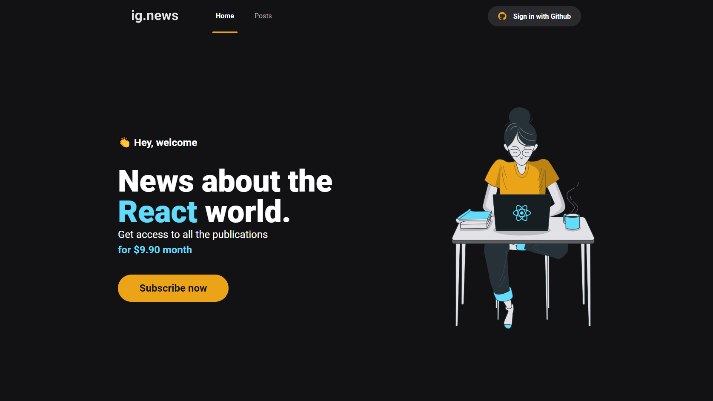
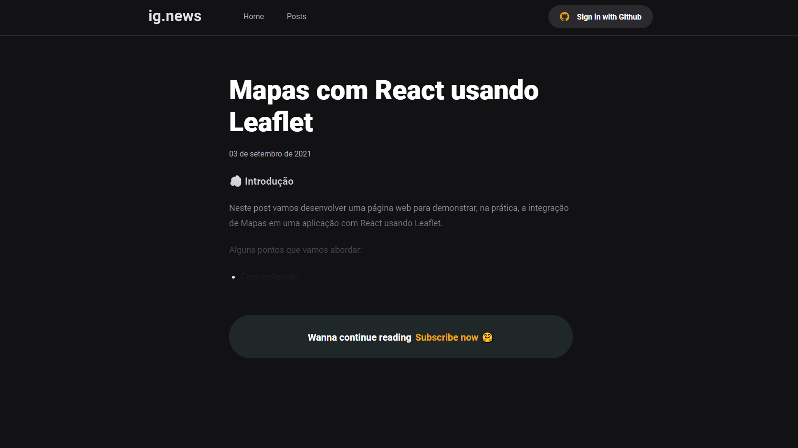

<h1 align="center">
  
</h1>

## 📌 Index

- [Sobre o projeto](#-sobre-o-projeto)
- [Screenshots](#-screenshots)
- [Techs](#-techs)

## ❔ Sobre o projeto

Nextjs blog com prismic e stripe.

## 📸 Screenshots

<h1 align="center">
  
</h1>

<h1 align="center">
  
</h1>

## 🛠 Techs

- [TypeScript](https://www.typescriptlang.org/)
- [React](https://pt-br.reactjs.org/)
- [Stripe](https://stripe.com/br)
- [NextJs](https://nextjs.org/)
- [NextAuth.js](https://next-auth.js.org/)
- [Prismic](https://www.prismic.io/)
- [Faunadb](https://fauna.com/)

---

